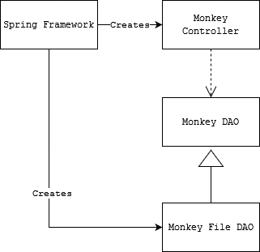
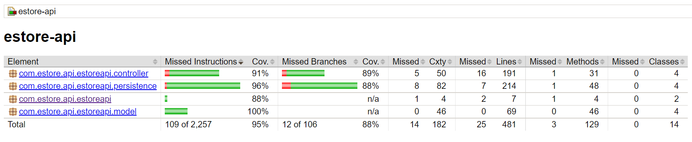

# PROJECT Design Documentation

## Team Information
* Team name: 5Guys
* Team members
  * Jack Yakubison jcy4561
  * Adrian Burgos awb8593
  * Eligh Ros edr5068
  * Trent Wesley taw8452
  * Jack Hester jrh339

## Executive Summary

This project's purpose is to act as an E-Store used for renting monkeys. It is a website in which users can search, sort, and rent monkeys for specified dates. It can also be used by an admin account to create new monkey listings, edit monkey listings, or delete monkey listings. The E-Store will offer a review feature in which users who have rented a monkey in the past can write a review for it that other users can see.

### Purpose
The main goal of this project was to provide both a front-end for an e-store focused on renting monkeys for parties and an API to handle inventory management and data persistence. Another goal of this project is to handle authentication for both customers and owners, as well as a working shopping cart for customers to store desired products in until they are ready to proceed with renting.

### Glossary and Acronyms

| Term | Definition |
|------|------------|
| SPA | Single Page Application |
| MVP | Minimum Viable Product |
| DAO | Data Access Object | 
| API | Application Programming Interface |
| REST | Representational State Transfer |
| MVVM | Model窶天iew窶天iewModel |

## Requirements

Our application will provide users with the ability to rent various
monkeys as well as allowing the owners to actively manage the site through
admin control. In this project, we will be required to develop controls for
the owners to utilize to effectively manage the e-store, such as as creating,
deleting, and updating the monkeys within the store. We will also be required
to effectively build a website from the front-end, developing product pages that
show the details of each monkey, a way to search through the list of monkeys by means
of a search bar and filters, and a shopping cart to checkout. In addition, we will
have to create a system for users and admins to log in, as well as a way for users to
post reviews of monkeys they previously rented, which will contribute to a rating system
for the monkeys.

### Definition of MVP
The minimum viable product for this project is a running website in which users have access to a variety of monkeys, which they can add to a shopping cart and request to rent. It should also have an admin account which has the ability to change the inventory on the website. Lastly, users should be able to write reviews for monkeys that they rented that can be accessed by other users.

### MVP Features
- Login Backend
- Login Page
- Owner Features
- Product Page
- Search for product
- Get a product
- Update a product
- Create a new product
- Delete a product
- Search bar
- Enable Filters
- Shopping Cart
- Rental Backend
- Post Review
- Read Reviews

### Roadmap of Enhancements
Our biggest enhancement is the ability to rent a monkey for your event rather than simply purchasing one, which would be impractical to do through an e-store.

We have also implemented the ability to write reviews after you return a monkey that you have rented. Each monkey's
product page displays their average rating, as well as a list of written reviews from users who have rented them.

## Application Domain

This section describes the application domain.

There are two ways to access the e-store. Using a username, the system authenticates each user as either a customer or an admin. Customers on the e-store can view a list of products and add or remove them from their shopping cart, from which they can later checkout from. Customers can then return monkeys that they are currently renting, and are prompted to leave a review for other users to see. Unlike customers, the owner, authenticated as admin, can manage the e-store's inventory, which contains all of the products in the e-store. The owner can manage the e-store by adding, removing, or updating the specific details of monkeys in the inventory. 

## Architecture and Design

This section describes the application architecture.

### Summary

The following Tiers/Layers model shows a high-level view of the webapp's architecture.

The e-store web application, is built using the Model窶天iew窶天iewModel (MVVM) architecture pattern. 

The Model stores the application data objects including any functionality to provide persistance. 

The View is the client-side SPA built with Angular utilizing HTML, CSS and TypeScript. The ViewModel provides RESTful APIs to the client (View) as well as any logic required to manipulate the data objects from the Model.

Both the ViewModel and Model are built using Java and Spring Framework. Details of the components within these tiers are supplied below.

### Overview of User Interface

When launching the e-store, the user will first be greeted to a login page where the user will
be prompted to login with their username or create a new account. Once the user has either logged in
or created an account, they will be redirected to the productlist page, where the list of monkeys
is displayed, as well as a search box to find specific monkeys. If the user is an admin, they can also 
edit and add monkeys while on this page via text boxes and buttons. When clicking on a monkey, the monkey's 
page will be displayed, showing information regarding the species, name, id, description, cost, and 
availability of the monkey, as well as an option to add it to the user's cart. This page also displays the monkey's
average rating and a list of user-written reviews. When on the productlist page the user can be redirected to their 
cart by clicking on the cart icon and from their they will be taken to a page where they can remove monkeys from 
their cart as well as checkout using the Checkout button, which updates the status of each rented monkey's 
availability and adds each of them to the user's current rentals list. On the user's current rentals page, they can
view the monkeys that they are currently renting and return them when ready, at which time they are also prompted 
to leave that monkey a review.

### View Tier

When opening the website UI, the first thing a user will see is the Login Page Component which will give an option to enter your username or create a new one. If the username "admin" is typed, the Owner Features Page will be opened. This page contains a user interface which allows the admin to update monkey information, create a new monkey for the estore, or delete a monkey from the estore.

If the user logs in with a customer account or creates a new account (which will automatically be a customer account) at the Login Page, the Buyer Product List Component will be opened up. The Buyer Product List contains a list of all the monkeys in the estore and another list of monkeys which is generated based on the search using the search bar.

After clicking a button for a specific monkey from the Buyer Product List, the Product Page Component will be opened on the same page. This will contain information about the selected monkey and an option to add to cart. This information includes their price, species, description, average rating, and list of user-written reviews.

The Shopping Cart Component is shown on the Buyer Product List. This displays the monkeys currently in the user's shopping cart as well as a button to checkout and a button for each monkey to remove from the shopping cart.

### ViewModel Tier

The ViewModel Tier consists of the MonkeyController Class, the UserController Class, the Monkey Service Component, and the User Service Component. The MonkeyController class handles REST API requests involving monkeys in the e-store. The UserController Class handles REST API requests involving user accounts. 

The Monkey Service Component sends REST API requests to the MonkeyController to obtain information from the monkeys.json file where monkey information is stored. The User Service Component sends REST API requests to the UserController to obtain user information.

### Model Tier

The Model Tier of our project communicates with the ViewModel Tier by receiving updates regarding user actions and requests, and in return sending it notifications relating to the back-end functions of the e-store and its inventory. It also houses our business logic and handles the system's data persistence. The logic is specifically concerned with managing the e-store's monkeys and users. The component concerned with product management gives the abilities of creating and removing monkeys from the inventory, as well as updating a monkey's specific details, such as one's species, description, and price. The user component provides the necessary abilities to create or manage specific users, manage the items in a user's shopping cart, and managing a user's list of currently rented monkeys.

Our project's backend also uses the Spring Framework. The Spring Framework creates the Monkey Controller, which depends on the Monkey DAO, which defines the interface for Monkey objects in the system. The MonkeyFileDAO inherits the Monkey DAO and implements the functionalities defined in the DAO. Upon instantiation of the MonkeyController object, the system will inject the MonkeyFileDAO into the MonkeyController object so that the MonkeyController can handle REST API requests relating to Monkey objects. Similarly, the Spring Framework creates the Review Controller and Rental Controller, which depend on their respective DAO's. The ReviewDAO defines the interface for Review objects, which each include an ID that matches the ID of the monkey whose list of reviews are contained in the object. Rental objects are similarly defined in its DAO. They also have their own ReviewFileDAO and RentalFileDAO to implement the DAO's functionalities. 

### Static Code Analysis/Design Improvements
Some improvements we would make if the project were to continue involve design decisions causing consistent code smells throguhout the code. A majority of our code smells involve an early design choice to use 'map' instead of 'foreach' in several places, whose uses of map are now going unused. If the project were to continue, we would most likely remove these instances and either leave them as removed or replace them with a 'foreach' statement to increase reliability.

One of our biggest current issues is our code's readability. This is due to several old outdated comments that either housed code that was not working or TODO tasks that were never deleted, which has hurt our code's readability. In the future, we would remove these to improve our readabiliy and code style consistency. We also had consistent code smells relating to minor unncessary add-ons, such as including type specifications where they are not needed. We would replace these type specifications with the diamon operator "<>" in the future because they are unnecessary in the version of Java we are using and are making the code longer and more verbose than it needs to be.  

## Testing
To ensure that the project is meeting our requirements, we conducted two types of tests. Acceptance testing allowed us to ensure that requirements related to the front-end of the e-store were working as expected, while Unit Testing allowed us to test the system itself and make sure it is handling everything correctly on the back-end. 

### Acceptance Testing
- 30 of stories that we finished pass all of their testing criteria
- 4 of the stories partially pass acceptance criteria
- 6 of the stories have yet to be tested

Most of the stories are currently passing their acceptance criteria tests. The issues found in the stories that are currently partially passing or failing came about when we noticed that they work or do not work in specific scenarios, or there is simply a small detail that is technically not correct. For example, the buyer product list's rented status does not currently update until the page is left and and returned to. These issues do not concern us as we are confident that we will be able to get these stories to a passing status in little time. The stories that have not been tested are the stories related to customer reviews, as they have not been implemented yet.

### Unit Testing and Code Coverage
The way that we have handled unit testing is by creating a doc of all tests that need to be written and allowing team members to evenly split the work among themselves. We have 100% coverage in the model tier and 95% coverage total. Our goal for overall coverage is 90% minimum but we like to strive for higher if we have time. We chose this number because it results in a balance of having enough testing without wasting time working on tests when more important parts of the project need to be done. Our lowest current element is estoreapi with a current coverage of 88%. The coverage is this low because main is not fully tested currently.

Our strategy in creating unit tests is to attempt to cover every method by checking its possible success and failure conditions ensuring that they match what we expect them to. For example, when writing unit tests for the creation of a monkey in the MonkeyController class, we tested the output from the MonkeyController Creation method when the monkey is created correctly, when the monkey creation is rejected, and when the MonkeyDAO throws an error. 
